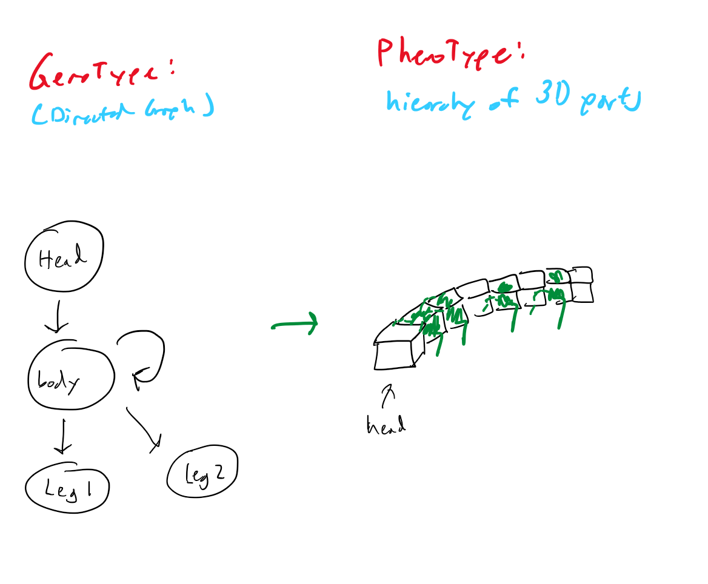
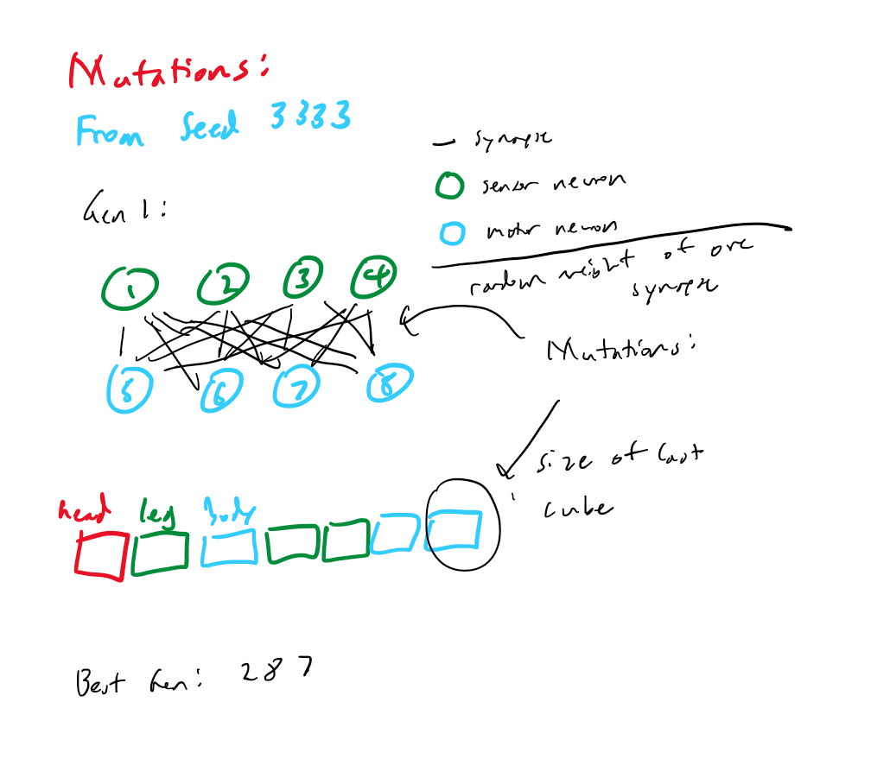
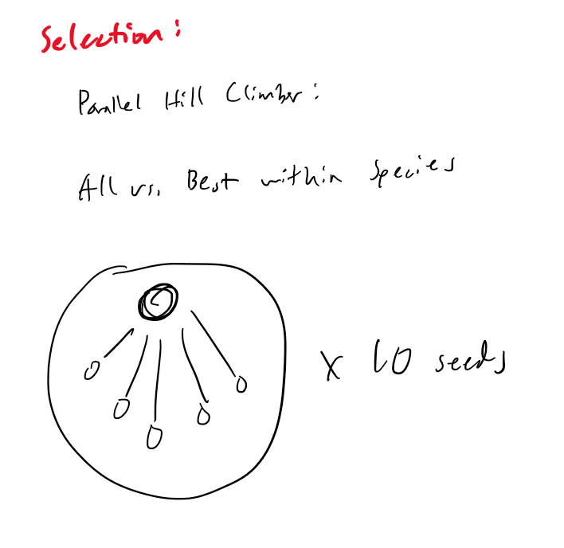

# CS 396 Artificial Life Final Project

## Intro

This is a Final Project submission, through the Engineer Path, for CS 396: Artificial Life at Northwestern University, Winter 2023 by Jim Wei.

**2 Minute Summary Video:** https://www.youtube.com/watch?v=4O5J5uceoZY

**Before/After Simulations:** https://www.youtube.com/watch?v=VzC-sw6ZVIA 

**10 Second GIF:**

**Note to Grader:** I spent a significant amount of time this assignment trying to get my Octopus from Assignment 7 to mutate correctly. He was never able to do so in time. Given the time constraints of running the 50,000 iterations, I decided to perform the mutations on my Assignment 8 submission (the incomplete Scorpion). Therefore, my submission fails the presupposed priori requirement. It also doesn't evolve very well, but we will get into that later. Finally, I wasn't able to save the best robots except for the final evolution of Seed 100001, which is saved in body.urdf.

## Overview & Summary

Hi. My name is Jim Wei, a junior at Northwestern University studying Computer Science and Learning & Organizational Change. In this course, I built a robot simulation on Python (code language) using a physics engine called PyBullet and a graphical tool program called PyroSim. My robot, using just cubes and connecting joints, can generate a random number of legs (between 2 to 6) on each face of a cube. Then, it can extend its legs a random number of cubes long, with each cube being a random size. Here's an example of the robot I built:

His name is Dr. Oc, like Doctor Octopus from Spider Man. Unfortunately, I was unable to get Dr. Oc to move, so I was unable to use him for my final assignment. Speaking of moving, our robots are able to move by attaching sensor neurons to certain parts of its body, which then communicate through synapse neurons with the motor neurons attached to joints within the robot. Then, we simply adjust the weights (power) of the synapse neurons to make each joint move a certain way. This is usuallly a random process, where we set the weights of the synapse neurons to be a random value, then randomly change each value to another random value and see how that impacts the robot's desired behavior.

We can measure a robot's desired behavior with a "fitness," which essentially means how fit a robot is to perform a given desired behavior or task. In our case, our "fitness" for robots were usually how far it could move on its own (locomotion, like a train moving forward). This is fairly easy to calculate, just randomly evolve a robot then measure how far it moves in a certain direction after a given amount of time.

Since Dr. Oc wasn't able to move, I created a Dr. Scorpion to replace him. He's not as physically impressive nor as random-ly impressive as Dr. Oc, but his simplicity allowed him to easily move. In terms of random generation, he has a snake body of a randomly generated number of connected cubes. Each cube is of random size, and random cubes are selected to become "legs." Leg cubes turn green and two little legs grow out of them, turning it into a scorpion. Here's a 10 second GIF of some of Dr. Scorpion's final forms:

And here's an image of the Genotype to Phenotype map of Dr. Scorpion:

## Dr. Scorpion Evolution:
Now, it's time to evolve Dr. Scorpion to move in a more fit manner. First, fitness for Dr. Scorpion's evolutions are how far it's first cube, titled "Head" in the image and labeled "Torso" in the code, moves towards the X axis of the simulation. The two ways Dr. Scorpion mutated were:

1. Brain mutation: A random change to the power (weight) of the synapse connection between a random sensor and motor neuron. The purpose of this mutation is to find the movement pattern for the motor neurons that will generate the highest fitness.
2. Body Mutation: A random size shift of the final Cube in the Scorpion's body, the "last" Cube if the Head/Torso were the first. The purpose of this mutation is to stabilize the movement of Dr. Scorpion using the final Cube's size, which will allow Dr. Scorpion to balance itself and remain upright.

Here's an image of Dr. Scorpion's mutations, along with some examples taken from Seed 3333 in the simulation. Note that, since I didn't modify my body according to the requirements of the project, I was unable to provide a more detailed evolution image.

## Dr. Scorpion Selection
In real life, the fitness that evolution selects for is generally for a species to survive until reproduction and to ensure that its offspring survives as well. As described above, the fitness we selected for in our project is much more simple than that. We simply wanted to see how far "Head" could be moved in the direction of the X axis (towards the camera).

The logic for selection was simple. First, we clone the parent and perform one Brain and Body mutation. This clone is called the child. Then, we run the simulation and determine whether the fitness of the child is greater than the parent. If it is, we replace the parent with the child, and update the fitness that is to be beaten by future generations to be the child's (which is now the parent) fitness. Otherwise, we scrap the child and another random brain and body mutation is performed on the parent.

For this project, I used 10 different seeds (to ensure reproducability of random generation) and performed simulations for 500 generations of 10 populations each, totaling to 50,000 total simulations.

The selection process in this project was the same as the "Parallel Hill Climber" selection process in Ludobots. Essentially, all children and future generations are compared to the Best performing individual within the species. Here's an image:

## Technical Methods
Here, I will be providing an overview of how my code works. This is a bit more technical, so feel free to skip if you don't care for how the simulation runs.

First, this project was built upon Pybullet and Pyrosim, which are used extensively in the code. The code is taken from the MOOC /r/Ludobots as well as assignments from CS 396: Artificial Life, which provided the base for geberating a robot and evolving it via best-fitness. A brief overview of the important files in the project:

1. Search.py: Where we run the program.
2. Solution.py: Here lies the code for generating the body of Dr. Scorpion, as well as mutating his brain and body. We also initialize myID here, which is the ID number of each individual scorpion.
3. Constants.py: Here, we set constants to be used throughout the project. We can also modify the number of generations, population size, and seed here.
4. parallelHillClimber.py: This is primarily code from /r/LudoBots, where we evolve and select the best parents and fitness for each evolution.
5. Simulate.py/Simulation.py: This is where the Pyrosim/Pybullet simulations are ran.
6. Analyze.py: This is where we are able to analyze the fitness values from the project and compile them into a digestible graph, which will be shown in the next section.
7. robot.py/motor.py/sensor.py/pyrosim folder: These enable our robots to be generated and to properly intialize the sensor, motor, and synapse neurons as well as the cubes and joints that we call from solution.

## Results:
After generation of 50,000 simulations, here are the final fitness results of each seed:

Here's the same graph without the Legend blocking some of the lines:

Here's a video of the before and after of each seed: https://www.youtube.com/watch?v=VzC-sw6ZVIA 

## Results Discussion:
As we can see from the graphs, there were often long periods of time where the evolution would get stuck. Furthermore, they all seemed to cap out at a certain point. I believe there are several reasons for this:

1. I had to shorten the simulation time due to time constraints regarding the 50,000 simulations. Therefore, even the better performing evolutions (ones that would continuously move forward) were not given enough time to travel as far as they'd like, especially compared to some that just lunged forward and stopped.
2. The calculation of fitness was could have been better. Since I only measured distance in a particular direction, there were some generations where the evolutions were walking in another direction well, but this was not being accounted by our calculation of fitness. Therefore, some of these final evolutions turned out to be just staying still, as 0 is a higher number than a negative (such as moving in the opposite direction).

In the future, I'd like to make further modifications to the body of Dr. Scorpion so he can evolve his body in ways that would suit evolution better, such as leg length or even joint axis. I'm also disappointed that I was unable to get Dr. Oc, my original robot, to move properly. I would like to fix him one day. Finally, I was unable to complete my dream project of creating a quacking, waddling duck in this course. I would like to work on my duck in the future.

## How to Run:

First, install Python 3.0 (latest), PyBullet, and Pyrosim.

Then, download repository from GitHub, modify the seed, number of generations, and population size variables in **constants.py**, then run **search.py** and it will generate a certain number of Scorpion Generations/Populations for viewing. Run **analyze.py** AFTER search.py and it will generate the fitness graph.

## References:
Base project code from: https://www.reddit.com/r/ludobots

Course Taken Winter 2023, CS 396: Artificial Life, by Professor Sam Kriegman.

Thanks for a fun quarter :)
