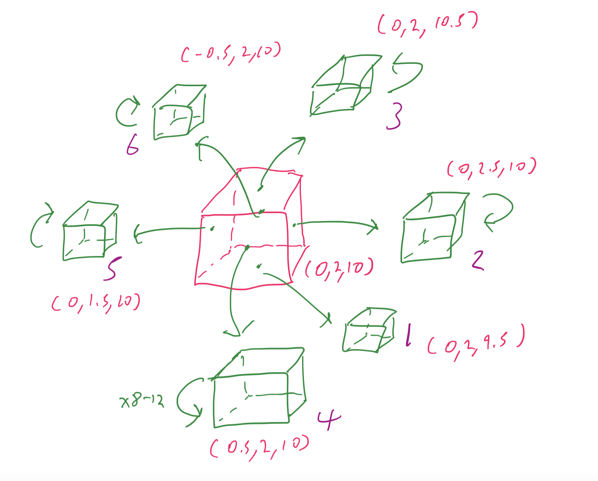

# CS 396 Artificial Life Assignment 7

## Overview

This is a submission for Assignemnt 7 for CS 396: Artificial Life at Northwestern University, Winter 2023 by Jim Wei.

First, this assignment builds on Assignment 6 by generating a random number of legs between 3 to 6, which then generate in different directions from a red center Torso, as shown in the diagram below. I call this creature Dr. Octopus. We can ignore the fact that he only has up to 6 legs.

In order to do this, I created an array for each value I needed to generate, and then stored dictionaries in each array element so that each array is an array of dictionaries and each element of the array is the dictionary for that particular leg of Dr. Octopus.

The red center cube is the Torso. The coordinates indicate the positional location of the center cube and the starting cube of each leg. The arrows indicate whether Dr. Octopus is generating outwards or repeating the creation of that leg. Finally, each cube is labeled in a purple number that indicates the order of which it will be generated depending on the random # of legs.

Note: for the sensors, motors, and synapses, I set an overall self.counter that keeps going up (that serves as the name for the sensors and motors. Then, for each individual leg, I count the number of Sensors and Joints (Motors), as well as arrays that save the name (self.count) of the sensors and motors. Finally, I set the synapses with two for loops that iterate through range(numOfSensors) and range(numofJoints), but the names don't match, so I take the names from the sensorsArray and the jointsArray.

## Random Behavior:

**Legs** Random number between 3 and 6

**Links:** Random number between 8 to 12, can be different for each Leg

**Size of Links:** Cube of x, y, z dimensions randomized from a range of 0 to 1 for each dimension. Each Leg has new sizes.

**Placement of Sensors/Motors:** 4 Sensors placed randomly within the chain of each Leg. Each sensor is placed at a different link so there will always be 4 sensors and motors. The placement of sensors will likely differ between each Leg.

## Video Example:
https://youtu.be/L3ZA3SuhO1A

## How to Run:

Download repository, run **assignment7.py** and it will generate Dr Octopus for viewing :). Must have python3 and pybullet installed.

## Notes:

To revert to evolving behavior, uncomment changes in search, parallelHillClimber, and simulate.

## References:
Base code from: https://www.reddit.com/r/ludobots

