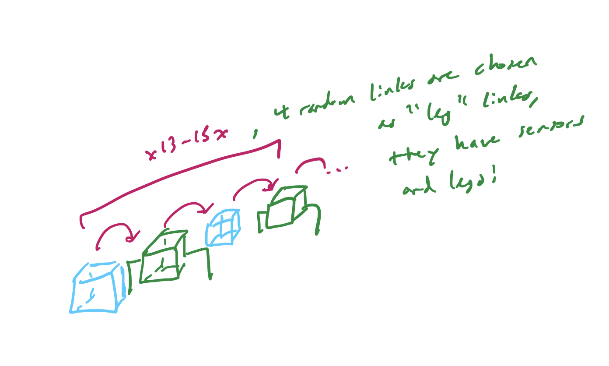

# CS 396 Artificial Life Final Project

## Overview

This is a Final Project submission for CS 396: Artificial Life at Northwestern University, Winter 2023 by Jim Wei.

**Note to Grader:** I spent a significant amount of time this assignment trying to get my Octopus from Assignment 7 to mutate correctly. He was never able to do so in time. Given the time constraints of running the 50,000 iterations, I decided to perform the mutations on my Assignment 8 submission (the incomplete Scorpion). Therefore, my submission fails the presupposed priori requirement. It also doesn't evolve very well, but we will get into that later.

Hi. My name is Jim Wei. In this course, I built 

The first blue cube is the Torso. Then, 13 to 15 links are attached behind the Torso cube, with 4 randomly selected links serving as the sensor and leg links.

Here are the fitness results per generation, with the specific seed and number of generations/populations shown in the Legend of the graph for 5 different seeds.

## Random Behavior:

**Legs** 4 randomly selected legs will contain sensor and motor neurons.

**Links:** Random number between 13 and 15 body links.

**Size of Links:** Cube of x, y, z dimensions randomized from a range of 0 to 1 for each dimension.

**Placement of Sensors/Motors:** 4 Sensors placed randomly in the Scorpion.

**Body:** The final cube, the Abdomen cube, is randomly changed to be a new size in each new iteration. This cube provides balancing and movement capabilities for the legs that touch the ground.

## Video Example:
https://youtu.be/L3ZA3SuhO1A

## How to Run:

Download repository, modify the 3 variables in **constants.py**, then run **search.py** and it will generate a certain number of Scorpion Generations/Populations for viewing :). Run **analyze.py** AFTER search.py and it will generate the fitness graph. Must have python3 and pybullet installed.

## References:
Base code from: https://www.reddit.com/r/ludobots
